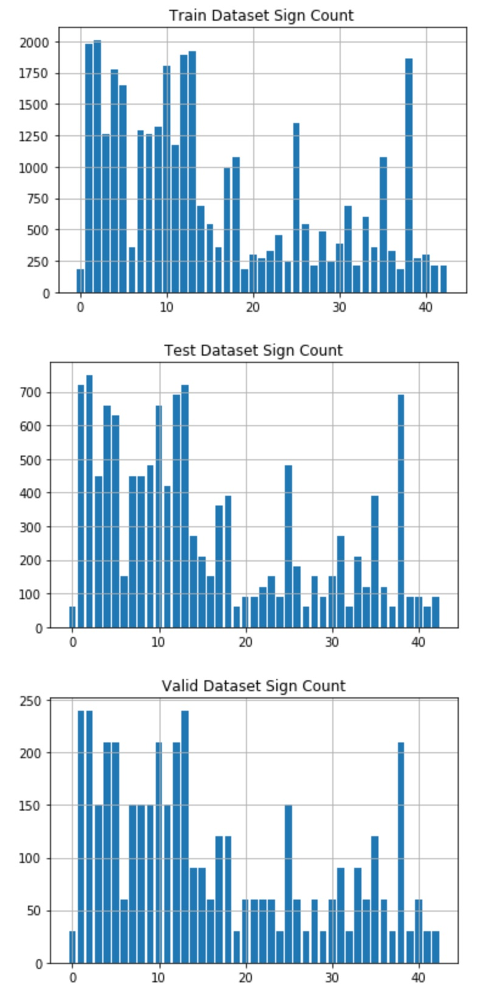
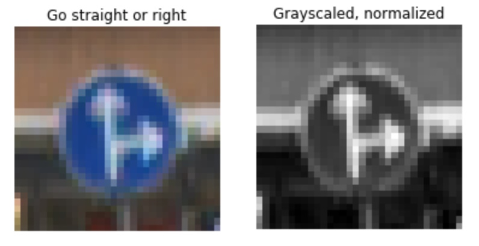
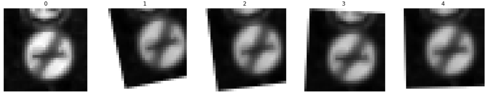

# **Recognizing Traffic Signs** 

**Goals**

The goals of this project are the following:
* Load the data set
* Explore, summarize and visualize the data set
* Design, train and test a model architecture
* Use the model to make predictions on new images
* Analyze the softmax probabilities of the new images
* Summarize the results with a written report

## Rubric Points
###Here I will consider the [rubric points](https://review.udacity.com/#!/rubrics/481/view) individually and describe how I addressed each point in my implementation.  

---
### Writeup / README

#### 1. Provide a Writeup / README that includes all the rubric points and how you addressed each one. You can submit your writeup as markdown or pdf. You can use this template as a guide for writing the report. The submission includes the project code.

Here is the link to my [project code](https://github.com/hogyadenes/CarND-Traffic-Sign-Classifier-Project/blob/master/Traffic_Sign_Classifier.ipynb)

### Data Set Summary & Exploration

#### 1. Provide a basic summary of the data set. In the code, the analysis should be done using python, numpy and/or pandas methods rather than hardcoding results manually.

The provided dataset consists of the following data:
 Number of training examples = 34799
 Number of validating examples = 4410
 Number of testing examples = 12630
 Image data shape = (32, 32, 3)
 Number of classes = 43
 
These are 32 by 32 images of 43 different classes of traffic signs. 

#### 2. Include an exploratory visualization of the dataset.

Here is an exploratory visualization of the data set. This bar chart showing how the traffic sign classes are distibuted inside each set. There are traffic signs with high sample count and there are also types that are relatively underrepresented. But at least the distibution is similar across the sets.

### Design and Test a Model Architecture

#### 1. Describe how you preprocessed the image data. What techniques were chosen and why did you choose these techniques? Consider including images showing the output of each preprocessing technique. Pre-processing refers to techniques such as converting to grayscale, normalization, etc. (OPTIONAL: As described in the "Stand Out Suggestions" part of the rubric, if you generated additional data for training, describe why you decided to generate additional data, how you generated the data, and provide example images of the additional data. Then describe the characteristics of the augmented training set like number of images in the set, number of images for each class, etc.)

As a first step, I decided to convert the images to grayscale. This makes the normalization easier and makes the training faster by considerably decreasing the input dimension.

Here is an example of a traffic sign image before and after grayscaling and normalizing

I also generated additional data by making small transformations (rotation and translation) on the original images. This helps the trained network to better classify badly cropped or misaligned traffic signs. 

Here is an example of an original image and some augmented images:

 

#### 2. Describe what your final model architecture looks like including model type, layers, layer sizes, connectivity, etc.) Consider including a diagram and/or table describing the final model.

My final model consisted of the following layers:

| Layer         		|     Description	        					| 
|:---------------------:|:---------------------------------------------:| 
| Input         		| 32x32x1 grayscale image   							| 
| Convolution 3x3     	| 1x1 stride, valid padding, outputs 28x28x24 	|
| RELU					|												|
| Max pooling	      	| 2x2 stride,  outputs 14x14x24 	- also tried avg_pooling but	these gave better results		|
| Convolution 3x3	    | 1x1 stride, valid padding, outputs 10x10x48  |
| RELU					|												|
| Max pooling	      	| 2x2 stride,  outputs 5x5x48 				|
| Fully connected		| Flattened input with 1200 inputs, outputs 300								|
| RELU					|												|
| Fully connected		|  300 inputs, outputs 120								|
| RELU					|												|
| Output layer				| 120 inputs, 43 outputs        									|
 
This means I increased the network size and the training parameters considerably but also tried to keep it relatively manageable. 

#### 3. Describe how you trained your model. The discussion can include the type of optimizer, the batch size, number of epochs and any hyperparameters such as learning rate.

To train the model, I used an Adam optimizer with a learning rate of 0.001, a batch size of 512 and 10 epochs. I tried not to overtrain the network and it seemed that the accuracy peaked after 10 epochs and the validation accuracy started to deteriorate.

####4. Describe the approach taken for finding a solution and getting the validation set accuracy to be at least 0.93. Include in the discussion the results on the training, validation and test sets and where in the code these were calculated. Your approach may have been an iterative process, in which case, outline the steps you took to get to the final solution and why you chose those steps. Perhaps your solution involved an already well known implementation or architecture. In this case, discuss why you think the architecture is suitable for the current problem.

My final model results were:
* training set accuracy of 0.999
* validation set accuracy of 0.975
* test set accuracy of 0.966

If an iterative approach was chosen:
* What was the first architecture that was tried and why was it chosen?
  I tried the original LeNet with unmodified inputs and parameter count. Then I normalized the data and augmented it (but still with the same network size). These gave me about 0.94 accuracy on the validation set but worked quite badly on some of my own test images. Then I tried to iteratively increase the size of each layers. I also changed the training hyperparameters a lot (increasing/decreasing the learning rate, epoch count and batch size - for the batch size I chose the biggest possible that my system could handle). 
* What were some problems with the initial architecture?
  
  The input was not normalized and the training set was not big enough to handle even the slightest variation of rotation/or translation of the signs (especially on underrepresented images). There were also not enough trainable parameters (especially in the fully connected layers). I also tried different pooling versions (avg_pooling and also mixed) but at the end I returned to max pooling because this gave me more consistent results.
  
* How was the architecture adjusted and why was it adjusted? Typical adjustments could include choosing a different model architecture, adding or taking away layers (pooling, dropout, convolution, etc), using an activation function or changing the activation function. One common justification for adjusting an architecture would be due to overfitting or underfitting. A high accuracy on the training set but low accuracy on the validation set indicates over fitting; a low accuracy on both sets indicates under fitting.

  I tried not to increase to network size first because in my experience very large networks tend to learn the training set easily but handle the real world problems worse especially if the training set is not big enough. So I initially kept the network size on the low end and also applied a dropout with a keep_rate of 0.5 during training. This proves that overfitting was my primary concern here while it was plain clear at the beginning that the network is not capable to learn the task with so few training parameters. So after all that I increased the size of each layer in small steps. 
  My approach delivers quite similar results on the validation and test sets and also gave a 100 percent accuracy on the random internet images so I am relatively content that it is an acceptable solution.
  
* Which parameters were tuned? How were they adjusted and why?

  I tuned the learning rate, the batch size and epoch count many times. I also played with the dropout parameter.

* What are some of the important design choices and why were they chosen? For example, why might a convolution layer work well with this problem? How might a dropout layer help with creating a successful model?

   Convolution layers work well because the many signs have similar shapes/and forms and it also helps the keep the training parameters low. The dropout helped considerable during training because it helped to limit overfitting by forcing the network to keep redundancies.

If a well known architecture was chosen:
* What architecture was chosen?
  
  The architecture was a modification of the LeNet architecture
  
* Why did you believe it would be relevant to the traffic sign application?

  It was recommended to try so I gave it shot and it proved to be really good for this task. It is also an easy to undestand and well documented structure with many real-world applications.
 
* How does the final model's accuracy on the training, validation and test set provide evidence that the model is working well?

  The model delivers similar and high accuracy on all three kind of sets as well as on my chosen test images.
 

### Test a Model on New Images

#### 1. Choose five German traffic signs found on the web and provide them in the report. For each image, discuss what quality or qualities might be difficult to classify.

Here are five German traffic signs that I found on the web:

![alt text][image4] ![alt text][image5] ![alt text][image6] 
![alt text][image7] ![alt text][image8]

The first image might be difficult to classify because ...

####2. Discuss the model's predictions on these new traffic signs and compare the results to predicting on the test set. At a minimum, discuss what the predictions were, the accuracy on these new predictions, and compare the accuracy to the accuracy on the test set (OPTIONAL: Discuss the results in more detail as described in the "Stand Out Suggestions" part of the rubric).

Here are the results of the prediction:

| Image			        |     Prediction	        					| 
|:---------------------:|:---------------------------------------------:| 
| Stop Sign      		| Stop sign   									| 
| U-turn     			| U-turn 										|
| Yield					| Yield											|
| 100 km/h	      		| Bumpy Road					 				|
| Slippery Road			| Slippery Road      							|

The model was able to correctly guess 4 of the 5 traffic signs, which gives an accuracy of 80%. This compares favorably to the accuracy on the test set of ...

####3. Describe how certain the model is when predicting on each of the five new images by looking at the softmax probabilities for each prediction. Provide the top 5 softmax probabilities for each image along with the sign type of each probability. (OPTIONAL: as described in the "Stand Out Suggestions" part of the rubric, visualizations can also be provided such as bar charts)

The code for making predictions on my final model is located in the 11th cell of the Ipython notebook.

For the first image, the model is relatively sure that this is a stop sign (probability of 0.6), and the image does contain a stop sign. The top five soft max probabilities were

| Probability         	|     Prediction	        					| 
|:---------------------:|:---------------------------------------------:| 
| .60         			| Stop sign   									| 
| .20     				| U-turn 										|
| .05					| Yield											|
| .04	      			| Bumpy Road					 				|
| .01				    | Slippery Road      							|

For the second image ... 

### (Optional) Visualizing the Neural Network (See Step 4 of the Ipython notebook for more details)
####1. Discuss the visual output of your trained network's feature maps. What characteristics did the neural network use to make classifications?

